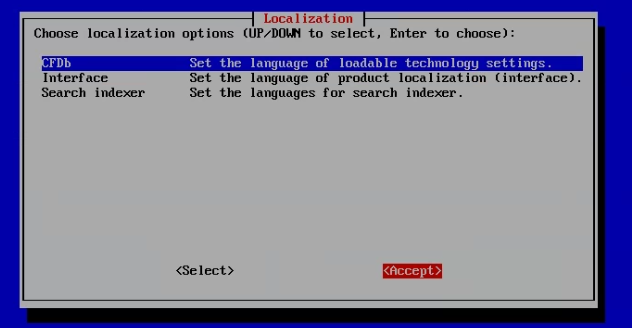
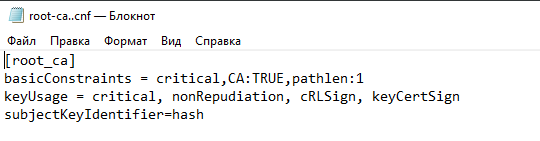

_**Перед тем как начать**_: прошу обратить внимание на то, что данный раздел репозитория составлен максимально подробно, но, тем не менее, я лично, а также другие люди, разработавшие данный проект, могли что-то упустить или описать в неправильном ключе. Не стоит воспринимать все описанное здесь как исключительную истину, проверяйте все в первую очередь самостоятельно.

Happy Hacking! :yum: :heartpulse:

---
### Часть 1. НАСТРОЙКА VMWARE
#### 1.1 Настройка сети

Для корректного функционирования системы необходимо использовать одинаковый сетевой адаптер, на каждой ВМ. Настроим DHCP (выдачу IP адресов) и параметры сетевых адаптеров. 


Удаляем VMnet8 или любой VMnet, у которого есть приписка NAT, так как сеть VMnet, может быть только трех типов NAT, Bridged, Host-only и не может повторяться.


Eсли VMnet10 уже существует нажимаем кнопку «Восстановить значение по умолчанию».


Если VMnet10 отсутствует - нажимаем на кнопку «добавить сеть» и выбираем VMnet10. Далее заполняем, как показано на рисунке. Задаем IP (192.168.10.10) и маску (255.255.255.0). Адрес подсети при этом 192.168.10.0


Следующий этап — это настройка DHCP. Нажимаем на настройки DHCP и задаем диапазон выдачи IP адресов от 192.168.10.10 До 192.168.10.100. Применяем настройки и закрываем настройки сети.


#### 1.2 Импорт виртуальных машин

Создаем директорию **virtual\_machines** и внутри еще 5 директорий. WinServ, IWTM, IWDM, Win\_1, Win\_2.


В представленных нам файлах находим. ovf файлы, нажимаем открыть с помощью "VMware":


При импорте называем каждую машину, как созданные директории и указываем для каждой машины путь до созданной директории. 


#### 1.3 Настройка ВМ

При условии наличия определенного объема оперативной памяти в вашей системе выделяем следующее ресурсы для ВМ.

|**ВМ**|**больше или равно 32 ГБ, ГБ**|**менее 32 ГБ, ГБ**|
| :-: | :-: | :-: |
|win\_serv|8|4|
|iwtm|8|4|
|iwdm|4|4|
|win\_1|4|2|
|win\_2|4|2|

В момент установки IWTM можно выделить ей 6-8 ГБ чтобы она быстрей установилась. После установки это значение можно уменьшить до 4Гб. Каждой ВМ настраиваем сетевой адаптер VMnet10 (NAT) и только его, лишние удаляем.


Каждой машине открываем общую папку с хостом. Для этого, заходим в настройки каждой ВМ и нажимаем поэтапно, как показано на рисунке. Общие папки будут работать с хостом при только наличии на ВМ **VMware Tools**.


---
### Часть 2. НАСТРОЙКА WIN\_SERV

#### 2.1 Настройка сети

Заходим в настройку сети с помощью команды **ncpa.cpl**. Заходим в свойства.


Вводим данные, как показано на рисунке. Задаем статический IP, маску, шлюз по умолчанию и DNS сервер. Нажимаем «ОК». **Заходим еще раз в меню и проверяем, что все сохранилось.**


> Не забудьте поставить галочку "Подтвердить параметры при выходе"

#### 2.2 Настройка Active Directory

Открываем Active Directory (**dsa.msc**). Необходимо создать 3 подразделения «Отдел IT» «Департамент 1» и «Департамент 2». Распределение пользователей по отделам, назначение прав:


| Пользователь | Пароль   | Отдел         | Права               | Комментарии                                                   |
| :----------: | :------: | :-----------: | :-----------------: | ------------------------------------------------------------- |
| user-pc      | xxXX2233 | Департамент 1 | Пользователь домена | Не требовать смены пароля и срок действия пароля не ограничен |
| user-gp      | xxXX2233 | Департамент 2 | Пользователь домена | -                                                             |
| iwdm-root    | xxXX2233 | Отдел IT      | Администратор домена, локальный администратор | -                                   |
| iwtm-admin   | xxXX2233 | Отдел IT      | Пользователь домена | -                                                             |
| ldap-sync    | xxXX2233 | Отдел IT      | Пользователь домена | -                                                             |

Создаем подразделения:


Добавляем пользователей:


Вводим имя пользователя и имя для входа в систему:


Вводим пароль и ставим галочку «Срок действия пароля не ограничен»:


Выдаем права пользователям:


Добавляем iwdm-rootв группы пользователей:


#### 2.3 Настройка NTP сервера на win\_serv

Открываем редактор групповой политики (**gpedit.msc**). Находим директорию по пути: Конфигурация компьютера → Административные шаблоны → Система → Служба времени Windows.


Меняем глобальные параметры конфигурации **AnnounceFlags = 5**


Заходим в поставщики времени:


Включаем NTP-сервер:


---
### Часть 3. УСТАНОВКА И НАСТРОЙКА IWTM

#### 3.1 Установка IWTM

Необходимо выполнить установку IWTM и .iso файла.


Создаем виртуальную машину и запускаем с .iso файла. Процесс установки IWTM состоит из следующих этапов ввода информации:

1. TM - Enterprise;
2. DB - PostgreSQL;
3. The ALL-in-one: TM+DB server - PostgreSQL;
4. Yes, discard my data; 
5. Europe/Moscow, System clock uses UTS = true (галочка);
6. Use ALL Space, Review and modify partitioning layout = true (галочка);
7. Next, Format;
8. DNS configuration → Hostname → iwtm → Primary DNS → **192.168.10.10** (IP-адрес win\_serv) → Secondary DNS → **8.8.8.8** → DNS search path → demo.lab;
9. Set NTP server hostname or ip address → **192.168.10.10** (IP-адресwin\_serv);
10. Все остальное accept или save

> ВНИМАНИЕ - настройку сети для IWTM можно произвести и через меню Device configuration (это поле находится в меню с DNS configuration). В случае, если вы производите настройку по рекомендации выше (что действительно проще), то настройки сети IWTM в пункте 3.2 производить не нужно

Установка IWTM:


Конфигурирование сетевых парамтеров:


Мы уже активировали NTP-сервер, поэтому сейчас можем продолжить настройку. Если NTP-сервер не активен, включите его и продолжайте настройку:





Пример проверки доступности узлов в сети:


#### 3.2 Настройка IWTM

Вводим **mcedit /etc/sysconfig/network-scripts/ifcfg-eth0** для конфигурирования сетевых параметров:


Добавляем в файл следующие строки:

```
DNS1=”192.168.10.10”
DNS2=”8.8.8.8”
SEARCH=”demo.lab”
IPADDR=”192.168.10.11”
NETMASK=”255.255.255.0”
BOOTPROTO=static
```


Сохраняем на F2, со всем соглашаемся и выходим на F10. Вводим **mcedit** **/etc/sysconfig/network** → Добавляем строчку → *GATEWAY=”192.168.10.0”*


Сохраняем на F2, со всем соглашаемся и выходим на F10. 

Вводим **mcedit /etc/resolv.conf** → Меняем строчку → *nameserver 192.168.10.10*


Сохраняем на F2, со всем соглашаемся и выходим на F10.  После чего прописываем команду **reboot**.

#### 3.3 Вход в web консоль IWTM

##### 3.3.1 Активация лицензии

Заходим в браузер, вводим IP-адрес IWTM. В Google Chrome в адресную строку вводим 192.168.10.11 (IP-адрес iwtm). 
Логин → officer, Пароль → xxXX1234.


Переходим во вкладку Управление → Лицензии, после чего добавляем лицензию InfoWatch TrafficMonitor:


##### 3.3.2 Включение LPAP-синхронизации

Далее переходим во вкладку Управление → LDAP-синхронизация. В ней добавляем новый LDAP-сервер, в котором прописываем (win\_server обязательно должен быть запущен): 


- ***Имя сервера** → win\_serv*
- ***Тип сервера** → Active Directory*
- ***LDAP-сервер** → 192.168.10.10 (это ip-адрес win\_serv)*
- ***LDAP-запрос** → dc=demo, dc=lab* 
- ***Логин** → ldap-sync, пароль → xxXX2233* 


После чего проверяем LDAP-соединение. Должно выплыть зеленое оповещение, которое сигнализирует о правильности введенных данных
##### 3.3.3 Добавление iwtm-admin в IWTM, назначение ролей, области видимости

Необходимо добавить пользователя iwtm-admin в iwtm, чтобы можно было выполнять вход под этим пользователем. Заходим во вкладку Управление → Управление доступ


Добавить → Добавить пользователя из LDAP → iwtm-admin


Находим пользователя в домене:


Добавим роли Администратора и Офицера безопасности пользователю iwtm-admin:


Также необходимо задать область видимости:


---
### Часть 4. НАСТРОЙКА IWDM

Заходим в пользователя **iwdm** (пароль xxXX1234)
#### 4.1 Настройки сети

Открываем сетевые подключения (**ncpa.cpl**). Ethernet0 → Свойства → Протокол Интернета версии 4 → Использовать следующий IP: **192.168.10.12,** маска подсети: **255.255.255.0**, шлюз: **192.168.10.2** (DNS шлюз win\_serv)→ Использовать следующие адреса DNS → **192.168.10.10** (ip адрес win\_serv), Альтернативный: **8.8.8.8**


#### 4.2 ПодключениеIWDM к домену

Открываем свойства системы (**sysdm.cpl**). Изменить параметры → Имя компьютера → Изменить → Является членом → рабочей группы. Указываем любое имя рабочей группы.


Выполняем перезагрузку и заходим в пользователя **iwdm** (пароль xxXX1234). Подключаем компьютер к домену: Открываем свойства системы (**sysdm.cpl**) Имя компьютера → Изменить → Является членом → Домена demo.labв открывшемся окне авторизуемся через iwdm-root (пароль xxXX2233), перезагружаем систему. Назад → Другой пользователь → demo\iwdm-root (пароль xxXX2233).

#### 4.3 Установка базы данных PostgreSQL

Сначала устанавливается PostgreSQL\_9.6.21\_64bit\_Setup, в котором нажимаем далее везде до Параметры сервера. На данном окне меняем Local на Russian, Russia, и вводим пароль суперпользователя xxXX2233. 


Далее ставим галочку на «Использовать параметры по умолчанию»


В окне Папка в меню «Пуск» ставим «Administrative Tools» и жмем кнопку установить


Далее устанавливаем **postgresql-9.5.25-1-windows-x64**. Листаем Далее до выбора Locale, где мы ставим Russian, Russia. После чего листаем до установки. После установки вылезет окно StackBuilder, в нем нажимаем отмена.


#### 4.4 Установка InfoWatch DeviceMonitor

После установки PostgreSQL необходимо поставить InfoWatch DeviceMonitor. Запускаем файл **Setup.DeviceMonitor.ru.x64.6.10.16.370**. В нем листаем до Выбор базы данных, в котором мы выбираем PostgreSQL. 


Далее на Установка или обновление базы на PostgreSQL вводим следующие значения: Сервер БД → 127.0.0.1, Имя базы данных → iwdm, Имя пользователя → postgres, Пароль → xxXX2233. Далее создаем новый ключ и сохраняем его под именем key:


В качестве учетной записи администратора сервера пишем: Имя пользователя → officer, Пароль → xxXX2233.


Далее нам необходим будет токен авторизации для DeviceMonitor. Его можно найти в WEB-консоли TrafficMonitor в разделе. Управление → Плагины → InfoWatch Device Monitor → Токены:


Далее в окне Настройка соединения с Traffic Monitor вводим следующие данные: Адрес сервера TM → IP-адрес iwtm, Токен авторизации из WEB-консоли TrafficMonitor. 


#### 4.6 Добавление iwdm-root в консоли управления

Это необходимо для авторизации без использования пароля. Авторизация в IWDM через **officer** **xxXX2233**.


Это необходимо, чтобы выполнять вход в консоль без ввода пароля. Инструменты → Пользователи консоли и роли


Если у вас отсутствуют кнопки добавить изменить, то вам нужно изменить масштаб экрана виртуальной машины на 100%. (control). Процесс смены масштаба представлен на рисунках 64 – 67.


Снизу нажимаем применить. Выходим из системы и заходим заново. Входим в консоль и добавляем роли и области видимости. Добавляем пользователя iwdm-root из Active Directory (Добавить из AD):


Пишем имя **iwdm**→ найти → DemoDept → iwdm-root@demo.lab → Сохранить


---
### Часть 5. ГРУППОВАЯ ПОЛИТИКА РАСПРОСТРАНЕНИЯ ПО

На win\_servоткрываем редактор групповых политик (**gpmc.msc**), создаем политику **Install Agent**.


После создания политики, необходимо задать её действия, а именно установка программы для пользователей. ПКМ по созданной политике → Изменить.


В открывшемся окне выбираем Конфигурация компьютера → Политики → Конфигурация программ → Установка программ → Нажимаем по ней ПКМ → Создать → Пакет


Открывается проводник, указываем путь до «**\\demolab.demo.lab\Share**». Предварительно в данную директорию нужно перенести все установщики.


Указываем метод развертывания «назначенный»


Чтобы точно выполнить установку, необходимо создать политику, которая будет ждать сеть с сервером, чтобы применились созданный политики. Назовем ее **Sync.** 


Открываем окно «изменить» → Конфигурация компьютера → Административные шаблоны → Система → Вход в систему → Всегда ждать сеть при запуске и входе в систему.


Включаем настройку «Всегда ждать сеть при запуске и входе в систему»


Открываем политику Install Agent → Делегирование → Добавить


Делаем поиск по компьютерам в домене


Добавляем компьютеры DEMOLAB (это наш win\_serv) и IWDM. Добавление происходит по одному. После этого, в разделе Делегирование → Дополнительно → выбираем DEMOLAB$ → Ищем в разрешениях (поле ниже) «Применить групповую политику» → Запретить. Аналогично для IWDM$.


После этого созданную политику **Install Agent** нужно перенести по иерархии «вверх» до домена **demo.lab**


---
### Часть 6. Установка WIN10\_1

#### 6.1 Устанавливаем клиентскую Win10

Загружаемся в пользователя WIN10пароль xxXX1234 или любого локального пользователя. Заходим в центр управления сетевыми подключениями (**ncpa.cpl**). Настраиваем сеть:


После настройки сети, заходим в свойства системы (**sysdm.cpl**). Меняем имя компьютера, выходим из домена и перезагружаемся.


Вводим имя пользователя домена. (желательно ldap-sync)


Перезагружаемся, затем, открываем Свойства системы (**sysdm.cpl**) → Изменить → Является членом → Домена → demo.lab


Логинимся в пользователя домена и перезагружаемся. После включения компьютера нажимаем Другой пользователь → user01:xxXX2233


Открываем Удаление или изменение программ (**appwiz.cpl**), у нас тут обязательно должен появиться InfoWatch Deploy Agent. Если этого не произошло, проверьте настроенную политику Install Agent, и выполните команду на win\_serv → cmd → **gpupdate /force**


Открываем win\_serv → DNS менеджер, добавляем узел для WIN\_CL01, с его IP адрес (**Ethernet1**), его можно узнать открыв **CMD** → **ipconfig** (нужная сеть выделена белым)


Добавляем новый узел, указываем имя компьютера, и IP-адрес устройства (**Ethernet1**)


Проверяем работоспособность, идем на IWDM, открываем CMD → **nslookup WIN-CL01, должен отобразиться адрес Ethernet1.**


#### 6.2 Добавление компьютеров в AD

После запуска компьютеров необходимо перейти на win\_serv, создать два новых раздела «Департамент 1» и «Департамент 2». После этого переходим в раздел «Computers» и перетаскиваем **WIN10-01** и **WIN10-02 в «Департамент 1».** iwdm нужно перенести в «**DemoDept**»


---

### Часть 7. ПРОВЕРКА РАБОТОСПОСОБНОСТИ СИСТЕМЫ

#### 7.1 Создание тега, политики, объекта защиты

Создадим тег «ДемоЭзкамен». Списки → Теги


Указываем имя тега, цвет.


Создадим категорию и термин, который будет подлежать защите. Технологии → Категории и термины


Также, чтобы указать по каким данным происходит срабатывание политики безопасности необходимо создать новую **категорию безопасности**. 


Далее, в созданной категории безопасности необходимо создать«термин безопасности», которые будут подлежит защите


Указываем текст, на который будет срабатывать DLP-система, ставим положение ползунков «**Характеристический**» и «**Учитывать морфологию**» на «**активен**».


Создадим категорию защищаемых объектов защиты и самого объекта защиты. Для этого нужно перейти в «**Объекты защиты**».


Создаем категорию защищаемых объектов


Создаем объект защиты, которые использует категорию технологий, которые мы должны защитить


Выбираем какие технологии мы будем защищать и условия обнаружения, выбираем нашу категорию технологий.


Создаем политику защищаемых данных на обнаружение передачи, копирования и хранения. Политики → Добавить политику → Политика защиты данных.


Добавляем правило на обнаружение передачи защищаемой информации. Нажимаем ниже сохранить, после нажимем«Передачи» → «Добавить правило».


Оказалось, что добавлять компьютеры, а также отправители и получатели необязательно, в таком случае система будет мониторить весь траффик.


Добавляем правило на обнаружение копирования защищаемой информации


Оказалось, что добавлять компьютеры, а также отправители и получатели необязательно, в таком случае система будет мониторить весь траффик.


Добавляем правило на обнаружение хранения защищаемой информации


Оказалось, что добавлять компьютеры, а также отправители и получатели необязательно, в таком случае система будет мониторить весь траффик.


Оказалось, что добавлять компьютеры, а также отправители и получатели необязательно, в таком случае система будет мониторить весь траффик.


Меняем имя политики защиты данных на «проверка работоспособности системы».


#### 7.3 Создание задач распространения ПО

Переходим во вкладку «Задачи», добавляем новую задачу «Install»


Нажимаем «Добавить» → «Директория demo.lab»


Тут должны отобразиться компьютеры, на которые может поставитсья софт. (списком компьютеров на скриншоте дополнен ) Нажимаем «Далее» на всех пунктах.


По итогу, задача первичного распространения будет запущена, ПО будет установлен автоматически на компьютеры.


#### 7.4 Создание политик в IWDM

Переходим в консоль управления IWDM. Открываем раздел политики


Создаем политику «Проверка работоспособности системы».


Добавляем правило в политику.


**Создаем правило передачи информации по защищенным каналам**. Указываем название «передача\_1», указываем «**перехватчик**» → «**HTTP(S) Monitor»** → Убираем галочки с минимального и максимального размеров запроса.


**Создаем правило передачи информации по всем каналам.** **Перехватчик**» → «**HTTP(S) Monitor»** →Создать события для запросов, передаваемых по → Всем каналам. Убираем галочки с минимального и максимального размеров запроса.


**Создаем правило копирования информации.** Указываем название, перехватчик →Filemonitor→ Назначение копирования → Съемные устройства Убираем галочки с минимального и максимального размеров файла.


**Создаем правило копирования информации.** Указываем название, перехватчик → Filemonitor → Назначение копирования → Сетевые Ресурсы. Убираем галочки с минимального и максимального размеров файла.


#### 7.3 Синхронизация IWDM с AD

Панель состояний → Инструменты →** Настройки


Выбираем пункт «Интеграция с Active Directory»


Выбираем домен по кнопке «Выбрать домен из леса», «Синхронизуемые директории» выбираем домен demo.lab.  Политику не задаем. 


Указываем IP адрес win\_serv и порт 389


#### 7.4 Связываем политики с группами компьютеров

Созданные политики необходимо связать с группой компьютеров. Группы компьютеров → ПКМ Изменить


Заходим на виртуальную машину **win10-01** на сайт [**http://dlptest.com/http-post/**](http://dlptest.com/http-post/)и пробуем отправить фразу-триггер (демо экзамен). Проверяем логирование событий


---
### Часть 8. СОЗДАНИЕ СЕРТИФИКАТОВ

Генерируем корневой ключ


Создаем файл сертификата и вводим все атрибуты


Создаем и заполняем файл конфигурации



Подписываем сертификат 


Создаем серверный ключ


Создаем файл серверного сертификата


Создаем и заполняем файл конфигурации серверного сертификата


Подписываем серверный сертификат


Создаем файл pkcs12


Получаем следующий набор файлов


Импортируем корневой сертификат


Импортируем серверный сертификат на машину IWDM


---
### Часть 9. ПОЛИТИКИ
#### Задание 1. Создание политик

Создаем политики «Департамент 1» и «Департамент 2».


Связываем группу компьютеров «Департамент 1» с политикой «Департамент 1».


Связываем группу компьютеров «Департамент 2» с политикой «Департамент 2».


#### Задание 2. Установка консоли DeviceMonitor

Устанавливаем консоль управления DeviceMonitor на компьютер нарушителя.


Чтобы установить, необходимо ввести данные учетной записи администратора домена.


Проверим работоспособность установленное консоли. Как видно из рисунка, все работает.


#### Задание 3. Создание задач первичной установки и смены паролей при удалении

Создания задач для смены паролей при удалении DeviceMonitor и первичное распространение. Создаем задачу для первичного распространения. Переходим во вкладку «Задачи», создаем задачу, указываем первичную установку.


Создаем задачу для смены пароля деинсталляции агента DeviceMonitor.


Выбираем компьютеры, на которые будет применена задача.


Вводим пароль, который необходим будет для удаления агента.


---
### Часть 10. СОЗДАНИЕ ПРАВИЛ IWDM

Для удобства создания правил, иногда быстрее запустить процесс на машине нарушителя и найти его в консоли управления.

#### Правило 1

Запретить печать документов на сетевых принтерах. Также необходимо отдельным правилом разрешить печать на локальных принтерах.


#### Правило 2

Необходимо полностью запретить использование облачного сервиса GoogleDrive, разрешить полное использование сервиса DropBox, остальные сервисы настроить только в режиме чтения (разрешить скачивание).


#### Правило 3

Запретить запуск приложения calculator и mspaint. 


#### Правило 4

Необходимо запретить создание снимков экрана в текстовых процессорах (Word или Libre/Open Office Writer) для предотвращения утечки секретных расчетов и баз данных.


#### Правило 5

Необходимо запретить запись файлов на все съемные носители информации (флешки), оставив возможность чтения и копирования с них. В случае отсутствия USB-накопителей создать правило на сетевые расположения.


#### Правило 6

С учетом ранее созданной блокировки необходимо разрешить копирование только на один доверенный USB-накопитель с помощью белого списка. В случае отсутствия USB-накопителей создать исключение для любого другого конкретного устройства (кроме CD/DVD).


#### Правило 7

Полностью заблокируйте доступ к CD/DVD на клиентском компьютере (виртуальной машине). В случае отсутствия CD/DVD привода его необходимо создать.


#### Правило 8

Осуществить выдачу временного доступа (30 минут) клиенту до заблокированного CD/DVD привода.


#### Правило 9

Необходимо запретить доступ к буферу обмена в приложениях wordpad и firefox.


#### Правило 10

Необходимо поставить на контроль печать документов на принтерах. Продемонстрировать работоспособность на любую из политик IWTM. 


#### Правило 11

На машине нарушителя необходимо запретить использование буфера обмена при подключении к удаленным машинам по протоколу RDP.


#### Правило 12

Необходимо установить контроль за компьютером потенциального нарушителя в случае использования браузера edge (или Internet explorer) путем создания снимков экрана каждые 90 секунд или при переходе в другое окно.


#### Правило 13

Запретить передачу файлов документов типа MS Excel, Libre/Open Office Calc на съемные носители информации и в сетевые каталоги.


