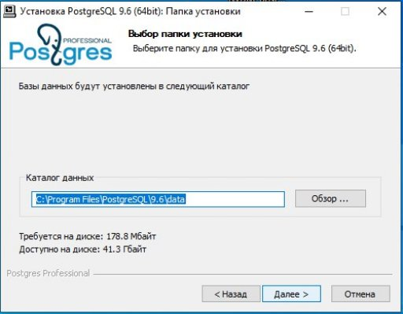
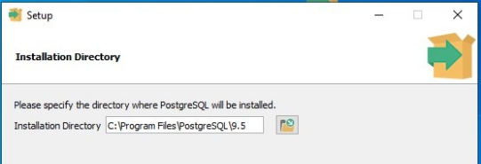

### 1. Установка DLP - системы InfoWatch Traffic Monitor

Для корректной работы DLP – системы InfoWatch Traffic Monitor необходимо подготовить машины со следующими операционными системами:
- Windows Server 2019, в данном курсовом проекте используется подготовленный сервер, с установленным доменом;
- Red OS 7.3.2 для установки Traffic Monitor;
- Windows 10 pro для установки Device Monitor;
- Windows 10 pro, которая будет использоваться непосредственно человеком на машине компании.

Для начала работы необходимо запустить машину с установленной операционной системой Red OS 7.3.2. После запуска нужно открыть терминал, войти в суперпользователя (root) и запустить службу SSH:

Следующим шагом необходимо перейти в параметры сетевых соединений:

После открытия параметров сетевых соединений, нужно изменить имеющееся подключение. Метод изменить на «Вручную» и добавить адреса подключения, в строке «Адрес» указываем IP-адрес, который будет присвоен данной машине, маска установится автоматически (24 или 255.255.255.0), в строке «Шлюз» необходимо указать IP–адрес сервера, в «Серверы DNS» дублируем IP-адрес сервера и в поисковой домен нужно вписать домен, установленный на сервере

Далее, необходимо проверить изменение параметров соединения, выполнив команду «IP a» в терминале, которая выведет все подключения и их настройки.

Следующим шагом необходимо создать папку в домашней директории:

Далее нужно подключиться к данной машине через программу WinSCP, для этого в «Имя хоста» необходимо указать IP-адрес присвоенный машине, а имя пользователя и пароль.

После успешного подключения необходимо произвести копирование файлов, требующихся для установки Traffic Monitor в созданную папку.

Далее нужно распаковать архив, находящийся в директории для получения доступа к находящимся внутри файлам

Следующим шагом необходимо открыть распакованный архив, и кликнуть правой кнопкой мыши по свободному месту, после чего нажать «Открыть в Терминале»

После открытия терминала заходим в суперпользователя и начинаем установку пакетов, необходимых для PostgreSQL

Следующим шагом необходимо установить пакет boost-devel, который необходим для корректной работы пакета pgagent

Далее нужно установить последний пакет, для postgresql, а именно pgagent.

После установки всех пакетов необходимо создать директории u01 и u02 в корне файловой системы

Далее инициализируем установленную базу данных

Следующим шагом запустим postgresql-13

После запуска необходимо изменить строку «Enviroment=PGDATA=…» на «Enviroment=PGDATA=/u01/postgres» в файле конфигурации posgtresql-13.service, который находится по следующему пути /usr/lib/system/systemd/postgresql-13.service

Для применения изменённого файла конфигурации необходимо выполнить следующую команду

Далее показано создание директории postgres по пути /u01/ и выдача прав владельца этой директорией пользователю postgres.

Далее показана инициализация базы данных

  
Ниже показано создание директорий tmp по пути /u01/postgres/, pgdata, pgdata1 и arch по пути /u02/ соответственно, и выдача прав владельца этих директорий пользователю postgres.

Следующим шагом необходимо изменить файл конфигурации iwtm-postgres, которы находится по пути /u01/postgres/iwtm-postgres.conf. В нём нужно изменить значения у следующих строк: shared\_buffers, temp\_buffers, work\_mem, effective\_cache\_size, min\_wal\_size, max\_wal\_size, maintenance\_work\_mem.

Выполнение команды для изменения владельца файла конфигурации iwtm-postgres.conf на пользователя postgres:

Далее нужно добавить в конфигурационный файл postgresql.conf ссылку на файл iwtm-postgres.conf

Ниже показана настройка файла доступа pg\_hba.conf.

Следующим шагом запустим и посмотрим статус postgresql-13.service

Далее показано изменение для администратора базы данных пароля по умолчанию.

Следующим шагом необходимо создать расширения для базы данных, требуемых для Traffic Monitor выполнив соответствующие запросы:

Далее показана настройка в операционной системе пользователя pgagent.

Далее необходимо отредактировать содержимое файла /etc/sudoers.d/pgagent:

Ниже продемонстрировано изменение прав, а также владельца и группы файла/etc/sudoers.d/pgagent.

Следующим шагом требуется запустить сервис pgagent и проверить его статус:

Для продолжения работы нужно добавить компьютер с Red OS в домен, для этого необходимо настроить Active Directory на Windows Server 2019

Следующим шагом в лесу домена нужно создать подразделения «Департамент» и «Отдел IT», в которых будут находится рабочие машины

После этого производится создание пользователя iwdm-root в подразделении «Отдел IT»

Далее, при создании пользователя iwdm-root необходимо поставить галочку на пункте «Срок действия пароля не ограничен»

Далее показано создание пользователя iwtm-root в подразделении «Отдел IT»

Далее, при создании пользователя iwtm-root необходимо поставить галочку на пункте «Срок действия пароля не ограничен»

Создаем также пользователя ldapsync

Далее показано создание пользователя user-pc в подразделении «Департамент».

Следующим шагом необходимо добавить пользователя iwdm-root в следующие группы: Администраторы, Администраторы домена, Компьютеры домена и Контроллеры домена

Далее нужно вернуться на машину с установленной Red OS и добавить ее в домен. Для этого необходимо открыть предустановленную утилиту «Ввод в домен» и выбрать «Домен Windows/Samba»

Следующим шагом вводим имя домена (demo.lab), имя компьютера (iwtm), а также имя и пароль администратора домена (iwdm-root)

Перед запуском установки Traffic Monitor нужно сделать файл инсталлятора исполняемым

Ниже показана команда для запуска инсталлятора Traffic Monitor

Начало установки Traffic Monitor

Следующим шагом необходимо выбрать тип продукта Traffic Monitor Standart

Далее показан выбор русского языка продукта

Также необходимо выбрать язык базы данных

В конфигурации аутентификации на сервере базы данных нужно оставить значения по умолчанию

Далее показан выбор типа хранилища сервера базы данных

При конфигурации хранилища сервера базы данных рекомендуется оставить значения по умолчанию

В настройки архивации ежедневных табличных пространств рекомендуется оставить все значения по умолчанию

При настройке удаления ежедневных табличных пространств рекомендуется оставить все значения по умолчанию

Конфигурация «Cosul» сервиса, а также настройка NTP-сервера «Nagios», сервис «Sphinx»:

Включение использования технологии технологии OCR

Выбор режима распознавания

Далее необходимо дать согласие на установку Traffic Monitor

После запуска установки необходимо дождаться конца установки, не выключать и не перезагружать компьютер

После окончания установки нужно проверить статус сервиса iwtm-consul, выполнив в терминале команду systemctl status iwtm-consul

Теперь необходимо перейти к настройке машины с операционной системой Windows 10 pro, на которую будет устанавливаться Device Monitor, для начала нужно выполнить команду ncpa.cpl, для открытия сетевых подключений

Следующим шагом нужно настроить IPv4

Далее необходимо подключить машину к домену, для этого нужно открыть свойства системы через «Параметры», либо через команду sysdm.cpl

Далее нужно нажать «OK», и в появившемся окне указать имя учетной записи и пароль администратора домена (iwdm-root)

Следующим шагом для изменения домена нужно перезагрузить компьютер и после перезагрузки войти под другим пользователем, а именно iwdm-root

Далее необходимо включить сетевое обнаружение

После включения сетевого обнаружения нужно создать папку в корне диска C и настроить общий доступ к этой папке

Далее необходимо произвести установку PostgreSQL 9.6

Далее необходимо задать параметры сервера PostgreSQL, порт 5432, нужно выбрать «Russia, Russia», в суперпользователя указать postgres и пароль к нему, а также включить контрольные суммы для страниц

Следующим шагом для более комплексной работы Traffic Monitor нужно установить Device Monitor:

Далее нужно указать тип устанавливаемого сервера и параметры установки Device Monitor

Далее показано определение параметров базы данных PostgreSQL, необходимо указать localhost как сервер базы данных, указать имя базы данных, имя пользователя и пароль.

Далее настройка защищенного канала, нужно оставить все значения по умолчанию и выбрать «Создать новый ключ»

Затем показана настройка учетной записи сервера, нужно выбрать «NetworkService»

Далее необходимо указать учетную запись администратора сервера Device Monitor

Далее нужно настроить соединение с Traffic Monitor, а именно указать адрес сервера Traffic Monitor и токен авторизации

Следующим шагом нужно начать установку Device Monitor

Далее необходимо настроить сеть на клиентской машине с установленной Windows 10 Pro. Для этого нужно перейти в настройку IPV4 и ввести значения, показанные ниже:

Следующим шагом требуется ввести клиентскую машину в домен demo.lab, для этого нужно открыть свойства системы через «Параметры», либо через команду sysdm.cpl, изменение имени компьютера и указание домена

Далее нужно нажать «OK», и в появившемся окне указать имя учетной записи и пароль контроллера домена (iwdm-root)

После успешного входа в домен, необходимо произвести перезагрузку системы и войти под учетной записью другого пользователя, а именно user-pc

Далее нужно на клиентской машине включить сетевое обнаружение

Следующим шагом необходимо произвести настройку Device Monitor, нужно настроить синхронизацию со службами каталогов

Далее в настройки синхронизации нужно добавить компьютеры и пользователей из домена demo.lab

Пример итогового окна синхронизации после настройки

Следующим шагом нужно создать политику «Департамент»

Ниже показано создание группы компьютеров, для корректной работы нужно связать группу компьютеров с политикой и добавить компьютеры в группу

Следующим шагом нужно создать задачу установки агентов на клиентские машины

Далее нужно выбрать на какие компьютеры будет распространяться задача

Далее нужно указать параметры настройки агентского модуля и запуска задачи

Статус созданной задачи

Далее нужно открыть мастер создания пакета установки и выбрать каталог, в который будет сохранен готовый набор инсталляционных пакетов

Следующим шагом необходимо создать объект групповой политики на Windows Server 2019. Чтобы перейти в меню управления групповой политикой нужно выполнить команду gpmc.msc. Ниже показано создание нового объекта групповой политики под названием установка агента.

Далее необходимо кликнуть правой кнопкой мыши и перейти в редактор управления групповыми политиками, далее пройти по пути Конфигурация компьютера → Политики → Конфигурация программ → Установка программ → Нажать правой кнопкой мыши → Создать → Пакет и указать источник установки.

Следующим шагом нужно открыть командную строку на Windows Server 2019 и выполнить команду gpupdate /force для обновления групповой политики

Далее необходимо открыть командную строку на клиентской машине и выполнить команду gpupdate /force для обновления групповой политики

После выполнения команды нужно перезагрузить машину, после которой будет установлен агент и в Device Monitor изменится статус поставленной задачи

Следующим шагом необходимо перейти к настройке Traffic Monitor, для этого в поисковой строке браузера вводим //iwtm или IP-адрес машины с установленным Traffic Monitor (192.168.10.21). После открытия нужно авторизоваться под пользователем officer, после успешной авторизации нажать «Еще» в верхней панели и кликнуть по пункту LDAP-синхронизация

Следующим шагом нужно перейти в панель управления доступом, нажать на «Добавить», выбрать пункт «Добавить пользователя из LDAP» и соответственно добавить нового пользователя

Далее нужно выбрать роли для добавленного пользователя

Следующим шагом нужно выбрать область видимости для добавленного пользователя

---
### 2 Создание политик защиты данных на агентах

В ходе выполнения задания были выбраны следующие политики защиты данных на агентах: блокировка копирования со съемного носителя и на съемный носитель паспортных данных и данных кредитных карт. Для создания политик безопасности необходимо перейти по ссылке «Политики» в верхней панели и нажать «Добавить политику», затем выбрать «Политика защиты данных на агентах»:

Следующим шагом нужно выбрать защищаемые данные

Ниже показаны выбранные защищаемые данные для политики безопасности

Следующим шагом нужно добавить правило копирования, направление маршрута «В оба направления», для отслеживания передачи паспортных данных как на устройство, так и с него, тип события «Съемное устройство», политика будет отслеживать исключительно передачу файлов, при которой используется съемный носитель, источники нужно оставить по умолчанию, необходимо назначить вердикт событию «Заблокировать», дабы избежать утечки паспортных данных уровень нарушения установлен «Высокий», тег события «На рассмотрении»

Следующим шагом нужно создать еще одну политику, которая будет отслеживать копирование данных кредитных карт с использованием съемного носителя. Необходимо выбрать защищаемые данные, объектом защиты является номер кредитной карты (16 цифр)

Следующим шагом нужно добавить правило копирования, направление маршрута «В оба направления», для отслеживания передачи данных кредитных карт как на устройство, так и с него, тип события «Съемное устройство», политика будет отслеживать исключительно передачу файлов, при которой используется съемный носитель, источники нужно оставить по умолчанию, необходимо назначить вердикт событию «Заблокировать», дабы избежать утечки данных кредитных карт, уровень нарушения установлен «Высокий», тег события «На рассмотрении»

Следующим шагом необходимо создать правило в Device Monitor для того, чтобы происходило отслеживание действий на клиентской машине

Далее нужно выбрать на что будет срабатывать правило, в поле «Перехватчик» необходимо выбрать «File Monitor», условие срабатывание поставить на источник копирования для отслеживания копирования на клиентскую машину и тип источника выбрать съемные устройства

Создание второго правила

Далее нужно выбрать на что будет срабатывать правило, в поле «Перехватчик» необходимо выбрать «File Monitor», условие срабатывание поставить на приемник копирования для отслеживания передачи с клиентской машины и тип источника выбрать съемные устройства

Следующим шагом необходимо применить конфигурацию в Traffic Monitor

---
### 3. Проверка работоспособности

После настроек политик безопасности необходимо проверить работоспособность. Первой политикой защиты данных на агентах было правило копирования паспортных данных на съемный носитель и со съемного носителя. Нарушив данную политику на машине клиента, появляется уведомление от Device Monitor

Далее нужно проверить отчет в Device Monitor

Следующим шагом необходимо убедиться в наличии отчета о нарушении в Traffic Monitor. На рисунке ниже видно, что отчет о копировании с машины клиента на съемный носитель присутствует, также есть графическое изображение копируемого документа.

На рисунке ниже показано, что отчет о копировании со съемного носителя на машину клиента присутствует, также есть графическое изображение копируемого документа

Также следует проверить передачу паспортных данных в формате текстового документа:

Следующей политикой защиты данных на агентах было правило копирования данных кредитных карт на съемный носитель и со съемного носителя. Нарушив данную политику на машине клиента, появляется уведомление от Device Monitor

Далее нужно проверить копирование данных кредитной карты в Device Monitor

Следующим шагом необходимо убедиться в наличии отчета о нарушении в Traffic Monitor. На рисунке далее видно, что отчет о копировании с машины клиента на съемный носитель присутствует, также есть графическое изображение копируемой кредитной карты.

Также следует проверить передачу данных кредитной карты в формате текстового документа. На рисунке ниже показано, что политика сработала на текстовый документ, в котором были записаны номера кредитных карт.

---
